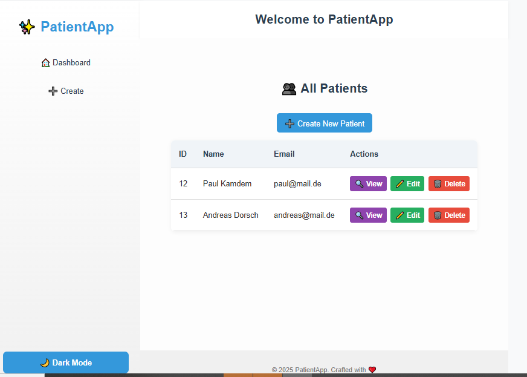
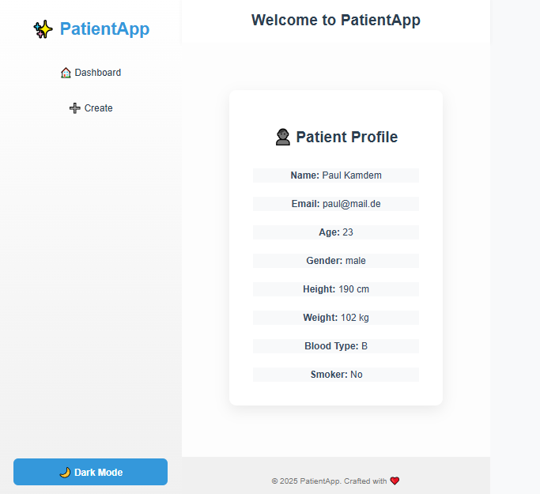
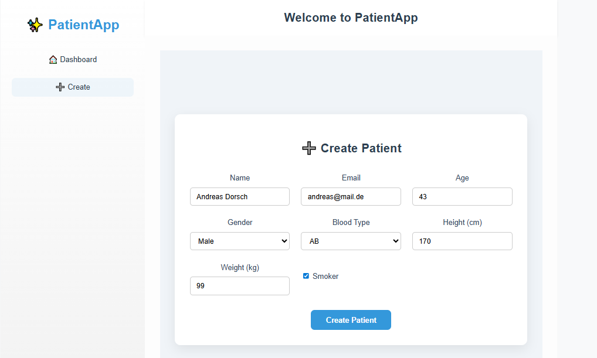

# 👥 Frontend for Patient Management 

> A sleek and responsive patient management interface built with **Vue 3 + TypeScript**. Create, edit, and explore patients for pohlig with ease.


---

## ✨ Demo

### 1. Dashboard


### 2. Detail


### 1. Forms



> Live demo coming soon...

---

## 🚀 Features

- 🧾 **Patient List** – View all patients in a clean layout
- 🔍 **Patient Detail** – See full info for each patient
- 📝 **Create/Edit** – Add or update patients with validation
- ❌ **Delete** – Remove patient instantly
- 🚫 **404 Page** – Friendly fallback for broken links
- Dark / Light mode

---

## 🛠 Tech Stack

| Frontend | Language | Routing | HTTP |
|----------|----------|---------|------|
| Vue 3    | TypeScript | Vue Router | Axios |

---

## 📦 Setup Instructions

```bash

# 2. Install dependencies
npm install

# 3. Start the dev server
npm run dev
```

## 🧪 Future Improvements

- Unit tests with Vitest
- Use Tailwind CSS
